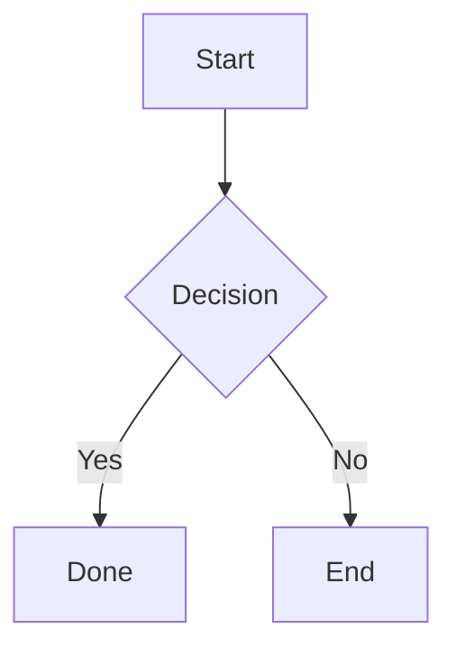

# sa3n.ru

Personal blog powered by [Hexo 7](https://hexo.io) with the ZenMind theme, published to GitHub Pages at [www.sa3n.ru](https://www.sa3n.ru).

## Prerequisites

- Node.js ≥ 18
- npm
- Git

## Setup

```bash
git clone https://github.com/LvovNikita/lvovnikita.github.io.git
cd lvovnikita.github.io
npm install
```

## Development

Start the local server with live reload (BrowserSync auto-refreshes the browser on file changes):

```bash
npm run dev
```

The site is available at http://localhost:4000.

## Creating content

### Post

```bash
npm run new:post -- "My Post Title"
# → source/_posts/My-Post-Title.md
```

### Page

```bash
npm run new:page -- "about"
# → source/about/index.md
```

### Draft

Drafts are not rendered in production (`render_drafts: false`). Useful for work-in-progress content.

```bash
npm run new:draft -- "My Draft Title"
# → source/_drafts/My-Draft-Title.md

# Preview drafts locally:
hexo server --draft

# Publish a draft (moves it to source/_posts/):
npm run publish:draft -- "My Draft Title"
```

## Scaffolds

The `scaffolds/` directory contains templates that Hexo uses when creating new content:

| File | Used by |
|------|---------|
| `scaffolds/post.md` | `hexo new post` |
| `scaffolds/page.md` | `hexo new page` |
| `scaffolds/draft.md` | `hexo new draft` |

Any front-matter fields added to a scaffold will appear in every new file created from it. For example, adding `categories:` to `scaffolds/post.md` means every new post will already have a `categories:` field ready to fill in.

## Mermaid diagrams

Use fenced ` ```mermaid ` blocks in any post or page:

````markdown

````

The `hexo-filter-mermaid-diagrams` plugin converts these blocks at build time and loads mermaid.js automatically. Version and theme are configured under `mermaid:` in `_config.yml`.

## Build & Deploy

| Command | What it does |
|---------|--------------|
| `npm run build` | Generate static files into `public/` |
| `npm run clean` | Delete `public/` and Hexo cache |
| `npm run deploy` | Clean → Generate → Push `public/` to the `master` branch on GitHub |

## Branch strategy

| Branch | Purpose |
|--------|---------|
| `main` | Source code — markdown posts, config, theme. Push here for all content and config changes. |
| `master` | Generated static site managed exclusively by `hexo deploy`. **Never push here manually.** |

Normal workflow:

```bash
# Edit content / config
git add .
git commit -m "add post: ..."
git push origin main       # save source

npm run deploy             # publish to GitHub Pages
```

## Project structure

```
.
├── scaffolds/             # Templates for new posts, pages, drafts
│   ├── post.md
│   ├── page.md
│   └── draft.md
├── source/                # All content
│   ├── _posts/            # Published posts (markdown)
│   ├── _drafts/           # Draft posts (not published)
│   ├── about.md           # About page
│   └── CNAME              # Custom domain for GitHub Pages
├── themes/
│   └── hexo-theme-ZenMind-main/   # Active theme
│       ├── layout/        # EJS templates
│       │   └── _partial/  # Reusable partials (header, footer, …)
│       └── source/        # Theme assets (CSS, JS, fonts)
├── public/                # Generated output — git-ignored, managed by Hexo
├── _config.yml            # Main Hexo configuration
└── package.json
```

## Configuration

Main config is in `_config.yml`. Theme-specific settings (navigation menu) are in `themes/hexo-theme-ZenMind-main/_config.yml`.

Deployment target (repo, branch) is under the `deploy:` key in `_config.yml`.
